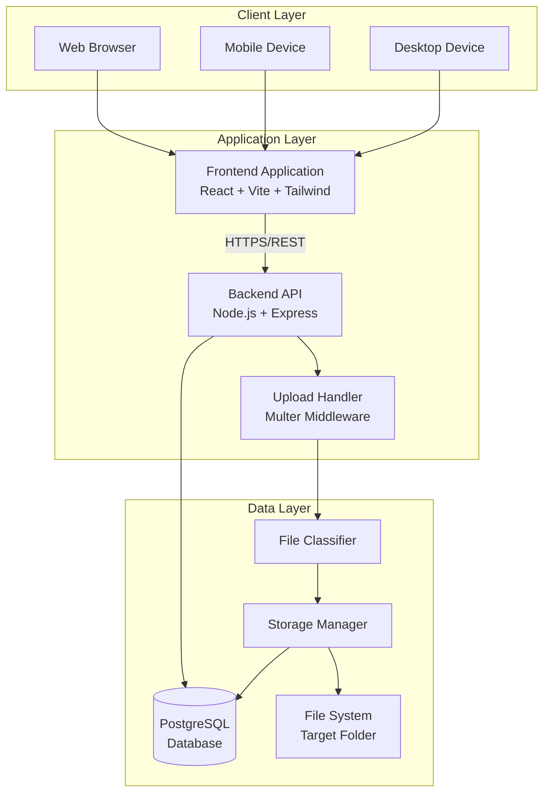
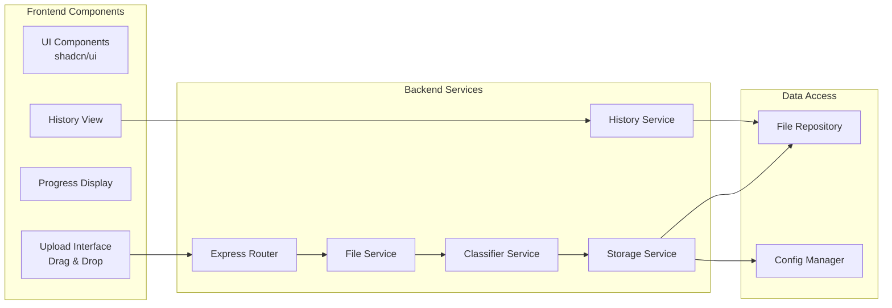

# Design Document: Web File Uploader

## Overview

The Web File Uploader is a full-stack web application that enables users to upload files from any device (mobile or desktop) and automatically store them in organized folders on a target PC's hard disk. The system provides online accessibility, automatic file classification, and a modern user interface.

### Key Design Goals

- **Accessibility**: Web-based interface accessible from anywhere via HTTPS
- **Automation**: Automatic file classification and organized storage by category
- **Scalability**: Built with modern stack (React, Node.js, PostgreSQL) to support growth
- **User Experience**: Drag-and-drop interface with real-time progress feedback
- **Reliability**: Robust error handling and file integrity verification

### System Boundaries

**In Scope:**
- Web-based file upload interface (React + Vite)
- Backend API for file processing (Node.js + Express)
- Automatic file classification by type
- Organized storage in category-based subfolders
- Upload history with metadata tracking
- Multiple file upload support
- HTTPS security

**Out of Scope:**
- User authentication/authorization (future enhancement)
- File sharing between users
- File editing or transformation
- Mobile native applications
- Real-time collaboration features

## Architecture

### System Architecture

The system follows a three-tier architecture:



### Component Architecture



### Technology Stack

**Frontend:**
- React 18+ (UI framework)
- Vite (build tool and dev server)
- Tailwind CSS (styling framework)
- shadcn/ui (component library)
- Axios (HTTP client)
- React Query (data fetching and caching)

**Backend:**
- Node.js 18+ (runtime)
- Express 4+ (web framework)
- Multer (file upload middleware)
- PostgreSQL 14+ (database)
- node-postgres (pg) (database client)
- dotenv (configuration management)

**Infrastructure:**
- HTTPS/TLS (security)
- File system storage (local disk)
- Optional: AWS S3 or Google Cloud Storage (future cloud storage)

## Components and Interfaces

### Frontend Components

#### 1. UploadInterface Component

**Responsibility:** Provides drag-and-drop file upload UI

**Props:**
```typescript
interface UploadInterfaceProps {
  onFilesSelected: (files: File[]) => void;
  maxFileSize: number;
  acceptedFileTypes: string[];
}
```

**Key Features:**
- Drag-and-drop zone with visual feedback
- File browser fallback
- File preview for images
- Multiple file selection
- Client-side validation

#### 2. ProgressDisplay Component

**Responsibility:** Shows upload progress for each file

**Props:**
```typescript
interface ProgressDisplayProps {
  uploads: UploadProgress[];
}

interface UploadProgress {
  fileId: string;
  fileName: string;
  progress: number; // 0-100
  status: 'pending' | 'uploading' | 'success' | 'error';
  category?: FileCategory;
  errorMessage?: string;
}
```

#### 3. HistoryView Component

**Responsibility:** Displays upload history with category information

**Props:**
```typescript
interface HistoryViewProps {
  sessionId?: string;
  limit?: number;
}

interface UploadHistoryItem {
  id: string;
  fileName: string;
  fileSize: number;
  category: FileCategory;
  uploadedAt: Date;
  deviceInfo: string;
}
```

### Backend Services

#### 1. FileService

**Responsibility:** Orchestrates file upload processing

**Interface:**
```typescript
class FileService {
  async handleUpload(
    file: Express.Multer.File,
    metadata: UploadMetadata
  ): Promise<UploadResult>;
  
  async handleMultipleUploads(
    files: Express.Multer.File[],
    metadata: UploadMetadata
  ): Promise<UploadResult[]>;
  
  async verifyFileIntegrity(
    filePath: string,
    expectedSize: number
  ): Promise<boolean>;
}

interface UploadMetadata {
  sessionId: string;
  deviceInfo: string;
  timestamp: Date;
}

interface UploadResult {
  success: boolean;
  fileName: string;
  category: FileCategory;
  storedPath: string;
  error?: string;
}
```

#### 2. ClassifierService

**Responsibility:** Identifies and classifies file types

**Interface:**
```typescript
class ClassifierService {
  classifyFile(
    fileName: string,
    mimeType: string
  ): FileCategory;
  
  validateMimeType(
    fileName: string,
    mimeType: string
  ): boolean;
  
  getSupportedExtensions(): Map<FileCategory, string[]>;
}

enum FileCategory {
  Photo = 'Photo',
  Video = 'Video',
  Document = 'Document',
  Audio = 'Audio',
  Archive = 'Archive',
  Other = 'Other'
}
```

**Classification Rules:**
- Photo: .jpg, .jpeg, .png, .heic, .webp, .gif, .bmp, .tiff
- Video: .mp4, .avi, .mov, .mkv, .wmv, .flv, .webm
- Document: .pdf, .doc, .docx, .xls, .xlsx, .ppt, .pptx, .txt
- Audio: .mp3, .wav, .aac, .flac, .ogg
- Archive: .zip, .rar, .7z, .tar, .gz
- Other: all other extensions

#### 3. StorageService

**Responsibility:** Manages file storage to disk with category-based organization

**Interface:**
```typescript
class StorageService {
  async saveFile(
    file: Express.Multer.File,
    category: FileCategory
  ): Promise<StorageResult>;
  
  async ensureCategoryFolder(category: FileCategory): Promise<string>;
  
  async resolveFileNameConflict(
    targetPath: string,
    fileName: string
  ): Promise<string>;
  
  async verifyStorageSpace(fileSize: number): Promise<boolean>;
}

interface StorageResult {
  success: boolean;
  storedPath: string;
  finalFileName: string;
  error?: string;
}
```

**Storage Structure:**
```
Target_Folder/
├── Photos/
├── Videos/
├── Documents/
├── Audio/
├── Archives/
└── Others/
```

#### 4. HistoryService

**Responsibility:** Manages upload history and metadata

**Interface:**
```typescript
class HistoryService {
  async recordUpload(record: UploadRecord): Promise<void>;
  
  async getSessionHistory(sessionId: string): Promise<UploadRecord[]>;
  
  async getRecentUploads(limit: number): Promise<UploadRecord[]>;
}

interface UploadRecord {
  id: string;
  fileName: string;
  originalName: string;
  fileSize: number;
  category: FileCategory;
  storedPath: string;
  mimeType: string;
  uploadedAt: Date;
  sessionId: string;
  deviceInfo: string;
}
```

### API Endpoints

#### POST /api/upload

Upload single or multiple files

**Request:**
- Content-Type: multipart/form-data
- Body: file(s) + metadata (sessionId, deviceInfo)

**Response:**
```json
{
  "success": true,
  "results": [
    {
      "fileName": "photo.jpg",
      "category": "Photo",
      "storedPath": "Photos/photo.jpg",
      "size": 2048576
    }
  ]
}
```

#### GET /api/history

Get upload history

**Query Parameters:**
- sessionId (optional): filter by session
- limit (optional): number of records

**Response:**
```json
{
  "uploads": [
    {
      "id": "uuid",
      "fileName": "photo.jpg",
      "fileSize": 2048576,
      "category": "Photo",
      "uploadedAt": "2024-01-15T10:30:00Z",
      "deviceInfo": "Chrome/Mobile"
    }
  ]
}
```

#### GET /api/config

Get client configuration

**Response:**
```json
{
  "maxFileSize": 524288000,
  "supportedCategories": ["Photo", "Video", "Document", "Audio", "Archive", "Other"],
  "acceptedExtensions": {
    "Photo": [".jpg", ".jpeg", ".png", ".heic", ".webp", ".gif", ".bmp", ".tiff"],
    "Video": [".mp4", ".avi", ".mov", ".mkv", ".wmv", ".flv", ".webm"]
  }
}
```

## Data Models

### Database Schema

#### uploads Table

Stores metadata for all uploaded files

```sql
CREATE TABLE uploads (
  id UUID PRIMARY KEY DEFAULT gen_random_uuid(),
  file_name VARCHAR(255) NOT NULL,
  original_name VARCHAR(255) NOT NULL,
  file_size BIGINT NOT NULL,
  category VARCHAR(50) NOT NULL,
  stored_path TEXT NOT NULL,
  mime_type VARCHAR(100) NOT NULL,
  uploaded_at TIMESTAMP NOT NULL DEFAULT NOW(),
  session_id VARCHAR(100) NOT NULL,
  device_info TEXT,
  checksum VARCHAR(64),
  created_at TIMESTAMP NOT NULL DEFAULT NOW(),
  
  INDEX idx_session_id (session_id),
  INDEX idx_uploaded_at (uploaded_at),
  INDEX idx_category (category)
);
```

#### configuration Table

Stores application configuration

```sql
CREATE TABLE configuration (
  key VARCHAR(100) PRIMARY KEY,
  value TEXT NOT NULL,
  description TEXT,
  updated_at TIMESTAMP NOT NULL DEFAULT NOW()
);
```

**Initial Configuration:**
- `target_folder`: Base path for file storage
- `max_file_size`: Maximum file size in bytes (default: 524288000 = 500MB)
- `concurrent_upload_limit`: Max concurrent uploads (default: 3)

### File System Structure

```
/path/to/target_folder/
├── Photos/
│   ├── image1.jpg
│   ├── image2.png
│   └── image3_1.jpg  (conflict resolution)
├── Videos/
│   ├── video1.mp4
│   └── video2.mov
├── Documents/
│   ├── document.pdf
│   └── spreadsheet.xlsx
├── Audio/
│   └── song.mp3
├── Archives/
│   └── backup.zip
└── Others/
    └── unknown.xyz
```

### Configuration File

**config.json** or **.env**

```env
# Server Configuration
PORT=3000
NODE_ENV=production
HTTPS_ENABLED=true
SSL_CERT_PATH=/path/to/cert.pem
SSL_KEY_PATH=/path/to/key.pem

# Storage Configuration
TARGET_FOLDER=/path/to/uploads
MAX_FILE_SIZE=524288000
CONCURRENT_UPLOAD_LIMIT=3

# Database Configuration
DB_HOST=localhost
DB_PORT=5432
DB_NAME=file_uploader
DB_USER=uploader_user
DB_PASSWORD=secure_password
DB_POOL_SIZE=10

# CORS Configuration
ALLOWED_ORIGINS=https://yourdomain.com,https://www.yourdomain.com
```


## Correctness Properties

A property is a characteristic or behavior that should hold true across all valid executions of a system-essentially, a formal statement about what the system should do. Properties serve as the bridge between human-readable specifications and machine-verifiable correctness guarantees.

### Property 1: Supported File Format Acceptance

For any file with a supported extension (photo, video, document, audio, or archive formats), the upload handler shall accept and process the file successfully.

**Validates: Requirements 2.2, 2.3, 2.4, 2.5, 2.6**

### Property 2: File Size Limit Enforcement

For any file with size ≤ 500MB, the upload handler shall accept it, and for any file with size > 500MB, the upload handler shall reject it with an appropriate error.

**Validates: Requirements 2.7**

### Property 3: File Storage Persistence

For any file successfully received by the upload handler, the storage manager shall save it to the target folder, and the file shall be retrievable from the file system.

**Validates: Requirements 3.1**

### Property 4: Original Filename Preservation

For any file uploaded with a unique name, the storage manager shall preserve the original filename when saving to disk.

**Validates: Requirements 3.2**

### Property 5: Filename Conflict Resolution

For any file uploaded with a name that already exists in the target folder, the storage manager shall append a numeric suffix (e.g., "_1", "_2") to create a unique filename.

**Validates: Requirements 3.3**

### Property 6: File Integrity Verification

For any file stored to disk, comparing the checksum of the original uploaded file with the stored file shall yield identical values, confirming data integrity.

**Validates: Requirements 3.4**

### Property 7: File Permission Assignment

For any file saved by the storage manager, the file shall have appropriate read/write permissions set according to the system configuration.

**Validates: Requirements 3.5**

### Property 8: File Classification by Extension

For any file with a known extension, the file classifier shall assign it to the correct category (Photo, Video, Document, Audio, Archive, or Other) based on the extension mapping.

**Validates: Requirements 3.1.1, 3.1.2, 3.1.3, 3.1.4, 3.1.5, 3.1.6**

### Property 9: MIME Type Validation

For any file uploaded, the file classifier shall verify that the MIME type is consistent with the file extension, and flag mismatches for additional validation.

**Validates: Requirements 3.1.8**

### Property 10: Category-Based Storage Organization

For any file classified into a category, the storage manager shall save it to the corresponding subfolder (Photos, Videos, Documents, Audio, Archives, or Others) within the target folder.

**Validates: Requirements 3.2.1, 3.2.2, 3.2.3, 3.2.4, 3.2.5, 3.2.6, 3.2.7**

### Property 11: Automatic Subfolder Creation

For any file category, if the corresponding subfolder does not exist in the target folder, the storage manager shall create it before saving the file.

**Validates: Requirements 3.2.8**

### Property 12: Multiple File Processing

For any set of multiple files uploaded in a single session, the upload handler shall process each file independently, and the success or failure of one file shall not prevent processing of the remaining files.

**Validates: Requirements 6.1, 6.2, 6.3**

### Property 13: Error Logging

For any error that occurs during upload, classification, or storage operations, the system shall create a log entry with error details, timestamp, and context information.

**Validates: Requirements 7.4**

### Property 14: Upload Metadata Recording

For any file successfully stored, the system shall create a database record containing complete metadata: filename, original name, file size, category, stored path, MIME type, upload timestamp, session ID, and device information.

**Validates: Requirements 8.1, 8.4**

### Property 15: History Query Response Structure

For any history query request, the API response shall include all required fields for each upload record: filename, file size, category, upload timestamp, and device information.

**Validates: Requirements 8.3**

### Property 16: Concurrent Upload Limit Enforcement

For any upload session with multiple files, the system shall enforce the configured concurrent upload limit, processing no more than the specified number of files simultaneously.

**Validates: Requirements 11.5**

### Property 17: Rate Limiting Protection

For any client making requests to the API, if the request rate exceeds the configured threshold within a time window, the system shall reject subsequent requests with a rate limit error until the window resets.

**Validates: Requirements 11.3**

## Error Handling

### Error Categories

The system handles errors across multiple layers:

#### 1. Client-Side Validation Errors

**Triggers:**
- File size exceeds 500MB
- Unsupported file type selected
- Network connectivity issues

**Handling:**
- Display user-friendly error messages via toast notifications
- Prevent upload attempt for invalid files
- Provide clear guidance on how to resolve the issue

**Example Messages:**
- "File size exceeds 500MB limit. Please select a smaller file."
- "This file type is not supported. Supported formats: [list]"
- "Network connection lost. Please check your connection and try again."

#### 2. Upload Processing Errors

**Triggers:**
- File corruption during upload
- Incomplete file transfer
- MIME type mismatch with extension

**Handling:**
- Reject the corrupted file
- Log detailed error information
- Return error response to client with specific error code
- Continue processing remaining files in batch

**Error Response Format:**
```json
{
  "success": false,
  "error": {
    "code": "FILE_CORRUPT",
    "message": "File appears to be corrupted",
    "fileName": "document.pdf"
  }
}
```

#### 3. Storage Errors

**Triggers:**
- Target folder inaccessible
- Insufficient disk space
- Permission denied on target folder
- File system errors

**Handling:**
- Reject upload immediately
- Log error with full context (path, permissions, available space)
- Return descriptive error to client
- Alert administrator if critical (e.g., disk full)

**Error Codes:**
- `STORAGE_UNAVAILABLE`: Target folder cannot be accessed
- `DISK_FULL`: Insufficient space for file
- `PERMISSION_DENIED`: Cannot write to target folder
- `FILESYSTEM_ERROR`: Unexpected file system error

#### 4. Database Errors

**Triggers:**
- Database connection failure
- Query timeout
- Constraint violation

**Handling:**
- File is still saved to disk (storage succeeds)
- Log database error
- Retry metadata recording with exponential backoff
- If retry fails, queue for later processing
- Return partial success to client

**Recovery Strategy:**
- Implement retry logic with 3 attempts
- Use background job to reconcile missing metadata
- Maintain consistency between file system and database

#### 5. Classification Errors

**Triggers:**
- Unknown file extension
- MIME type detection failure

**Handling:**
- Default to "Other" category
- Log classification uncertainty
- Store file successfully with "Other" classification
- Allow manual reclassification later

### Error Recovery Mechanisms

#### Retry Logic

For transient errors (network, database):
- Exponential backoff: 1s, 2s, 4s
- Maximum 3 retry attempts
- Log each retry attempt

#### Graceful Degradation

- If database unavailable: continue file storage, queue metadata recording
- If classification fails: use "Other" category
- If history unavailable: upload still succeeds

#### Transaction Boundaries

- File upload is atomic: either fully saved or not at all
- Metadata recording is separate transaction
- Partial failures are clearly communicated

### Monitoring and Alerting

**Critical Errors (Immediate Alert):**
- Target folder inaccessible
- Disk space below 10%
- Database connection lost

**Warning Conditions (Log and Monitor):**
- High rate of classification failures
- Frequent MIME type mismatches
- Repeated filename conflicts

**Metrics to Track:**
- Upload success rate
- Average upload time
- Error rate by category
- Storage utilization

## Testing Strategy

### Dual Testing Approach

The testing strategy employs both unit testing and property-based testing to ensure comprehensive coverage:

- **Unit Tests**: Verify specific examples, edge cases, and error conditions
- **Property Tests**: Verify universal properties across all inputs through randomized testing

Both approaches are complementary and necessary. Unit tests catch concrete bugs and validate specific scenarios, while property tests verify general correctness across a wide range of inputs.

### Property-Based Testing

**Framework Selection:**
- **JavaScript/Node.js**: Use `fast-check` library for property-based testing
- **Installation**: `npm install --save-dev fast-check`

**Configuration:**
- Each property test must run minimum 100 iterations
- Use appropriate generators for file metadata, sizes, extensions, etc.
- Each test must reference its corresponding design property

**Test Tagging Format:**
```javascript
// Feature: web-file-uploader, Property 1: Supported File Format Acceptance
test('property: supported file formats are accepted', () => {
  fc.assert(
    fc.property(
      fc.oneof(
        fc.constantFrom('.jpg', '.png', '.mp4', '.pdf', '.mp3', '.zip')
      ),
      (extension) => {
        // Test implementation
      }
    ),
    { numRuns: 100 }
  );
});
```

**Property Test Implementation Guidelines:**

1. **Property 1-2 (File Format and Size)**: Generate random file metadata with various extensions and sizes
2. **Property 3-7 (Storage)**: Generate random files and verify storage behavior
3. **Property 8-10 (Classification)**: Generate files with all supported extensions and verify correct classification and storage location
4. **Property 11 (Subfolder Creation)**: Test with missing subfolders
5. **Property 12 (Multiple Files)**: Generate random batches of files with some intentionally invalid
6. **Property 13-15 (Logging and History)**: Verify metadata completeness for random uploads
7. **Property 16-17 (Limits)**: Test with varying concurrent upload counts and request rates

### Unit Testing

**Framework Selection:**
- **Frontend**: Vitest + React Testing Library
- **Backend**: Jest + Supertest

**Test Categories:**

#### 1. Component Tests (Frontend)

Test specific UI components:
- UploadInterface: drag-and-drop functionality, file selection
- ProgressDisplay: progress bar rendering, status updates
- HistoryView: data display, filtering

**Example:**
```javascript
describe('UploadInterface', () => {
  it('should display drop zone when no files selected', () => {
    // Specific example test
  });
  
  it('should show error for oversized file', () => {
    // Edge case test
  });
});
```

#### 2. API Integration Tests (Backend)

Test API endpoints with specific scenarios:
- POST /api/upload: successful upload, error cases
- GET /api/history: pagination, filtering
- GET /api/config: configuration retrieval

**Example:**
```javascript
describe('POST /api/upload', () => {
  it('should upload a valid PDF file', async () => {
    // Specific example test
  });
  
  it('should reject file exceeding size limit', async () => {
    // Edge case test
  });
  
  it('should handle corrupt file gracefully', async () => {
    // Error condition test
  });
});
```

#### 3. Service Unit Tests

Test individual service methods:
- ClassifierService: specific extension mappings
- StorageService: conflict resolution examples
- HistoryService: query logic

**Example:**
```javascript
describe('ClassifierService', () => {
  it('should classify .jpg as Photo', () => {
    // Specific example
  });
  
  it('should classify unknown extension as Other', () => {
    // Edge case
  });
});
```

#### 4. Edge Case Tests

Focus on boundary conditions:
- Empty file upload
- File with no extension
- Extremely long filename
- Special characters in filename
- Target folder doesn't exist (initialization)
- Target folder full (storage error)
- Corrupt file detection

#### 5. Error Handling Tests

Verify error scenarios:
- Network failure during upload
- Database connection loss
- File system permission errors
- Invalid MIME type

### Integration Testing

Test complete workflows:
1. Upload → Classification → Storage → Database Recording
2. Multiple file upload with mixed success/failure
3. History retrieval after uploads
4. Configuration changes and system restart

### Performance Testing

**Load Testing:**
- Simulate multiple concurrent users
- Test with maximum file sizes (500MB)
- Verify concurrent upload limits

**Stress Testing:**
- Test with disk near capacity
- Test with high request rates (rate limiting)
- Test database connection pool under load

### Test Coverage Goals

- **Unit Test Coverage**: Minimum 80% code coverage
- **Property Test Coverage**: All 17 correctness properties implemented
- **Integration Test Coverage**: All critical user workflows
- **Edge Case Coverage**: All identified edge cases from requirements

### Continuous Integration

- Run all tests on every commit
- Property tests run with 100 iterations in CI
- Performance tests run nightly
- Coverage reports generated and tracked

### Test Data Management

**Fixtures:**
- Sample files for each supported format
- Test database with seed data
- Mock configuration files

**Generators (for property tests):**
- Random file metadata generator
- Random file size generator (0-600MB range)
- Random extension generator (supported + unsupported)
- Random filename generator (including edge cases)

